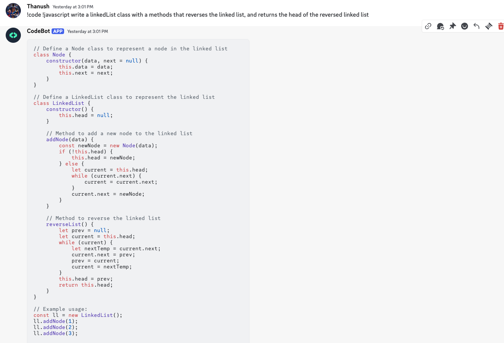
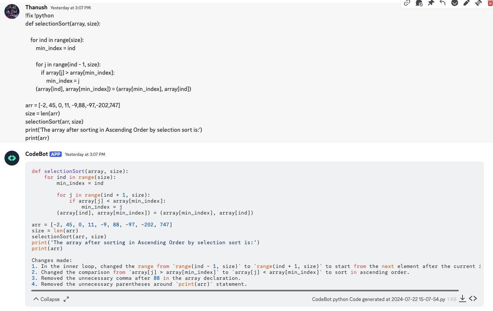
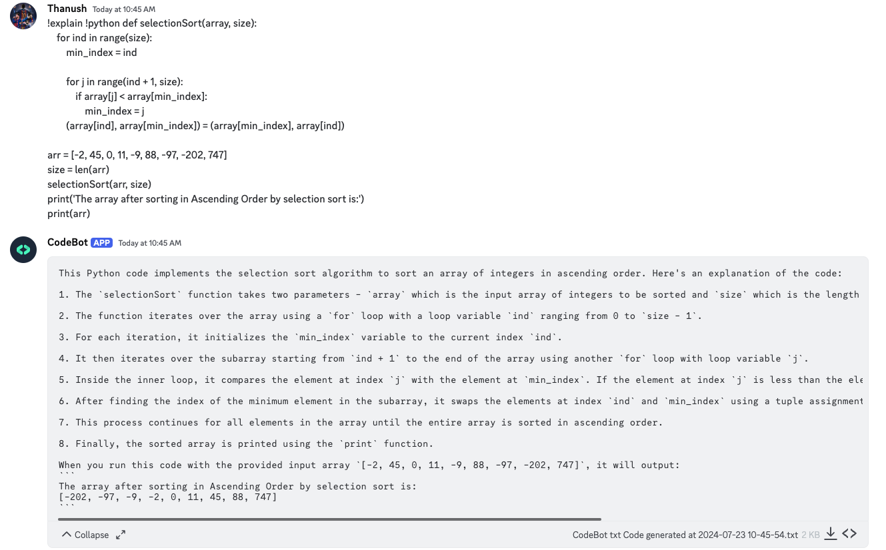

# CodeBot - A Discord Bot for Generating Code

CodeBot is a Discord bot designed to help developers by generating code snippets in various programming languages based on user input. This bot utilizes the OpenAI API to generate code snippets and can handle tasks such as writing new code, fixing existing code, and explaining code.

## Features
- Generate code snippets in multiple programming languages.
- Fix errors in existing code.
- Explain code functionality.
- Supports languages such as Python, JavaScript, Java, C#, PHP, Go, TypeScript, Ruby, Swift, and more.

## Examples
### Code:

### Fix:

### Explain:


## Getting Started

### Prerequisites

- [Go](https://golang.org/dl/) (version 1.16 or later)
- [Discord Bot Token](https://discord.com/developers/applications)
- [OpenAI API Key](https://beta.openai.com/signup/)

### Installation

1. **Clone the repository**:

    ```sh
    git clone https://github.com/yourusername/codebot.git
    cd codebot
    ```

2. **Install dependencies**:

    ```sh
    go get -u github.com/go-resty/resty/v2
    go get -u github.com/joho/godotenv
    go get -u github.com/bwmarrin/discordgo
    ```

3. **Setup environment variables**:

   Create a `.env` file in the root directory and add your Discord bot token and OpenAI API key:

    ```env
    DISCORD_TOKEN=your_discord_bot_token
    OPENAI_TOKEN=your_openai_api_key
    ```

4. **Run the bot**:

    ```sh
    go run main.go
    ```

## Usage

Invite the bot to your Discord server using the OAuth2 URL:
https://discord.com/api/oauth2/authorize?client_id=YOUR_CLIENT_ID&permissions=0&scope=bot
Replace `YOUR_CLIENT_ID` with your bot's client ID.

### Commands

- **Generate Code**: `!code !<language> <task>`
    - Example: `!code !python a function to reverse a string`

- **Fix Code**: `!fix !<language> <code>`
    - Example: `!fix !javascript console.log("Hello World)`

- **Explain Code**: `!explain !<language> <code>`
    - Example: `!explain go func main() { fmt.Println("Hello, World!") }`


## Supported Languages

| Languages      |               |             |             |
|----------------|---------------|-------------|-------------|
| Python         | JavaScript    | Java        | C#          |
| PHP            | Go            | TypeScript  | Ruby        |
| Swift          | Kotlin        | Rust        | Scala       |
| Perl           | R             | Shell       | HTML        |
| CSS            | SQL           | Dart        | Haskell     |
| Lua            | Objective-C   | C           | C++         |


## Contributing

Contributions are welcome! Please fork the repository and submit a pull request.

1. Fork the repository.
2. Create your feature branch (`git checkout -b feature/AmazingFeature`).
3. Commit your changes (`git commit -m 'Add some AmazingFeature'`).
4. Push to the branch (`git push origin feature/AmazingFeature`).
5. Open a pull request.

## License

This project is licensed under the MIT License. See the [LICENSE](LICENSE.md) file for details.

## Acknowledgements

- [OpenAI](https://openai.com/)
- [Discord](https://discord.com/)
- [Go](https://golang.org/)